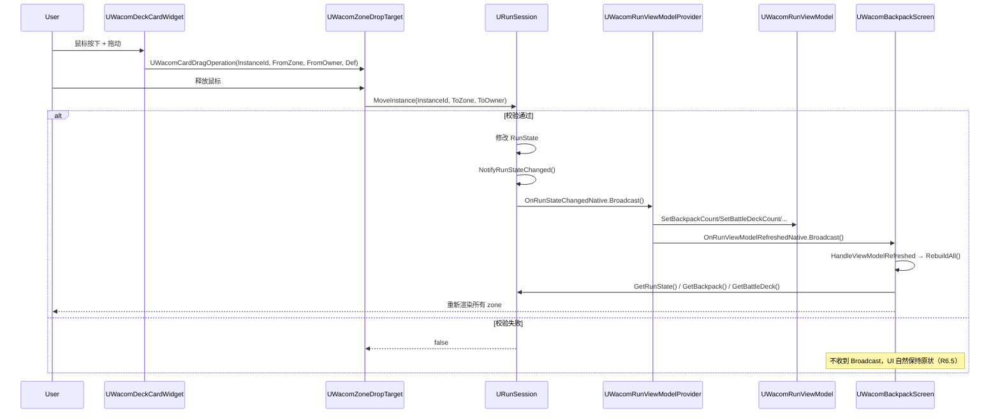

# Design Document — Stage 4.5 背包 B 类容器卡特殊存放区

## Overview

Stage 4.5 把 Stage 4.3 起就位的"B 类容器卡数据契约骨架"扩展为完整可玩闭环。整体改动分布在三个模块：

| 模块 | 改动核心 | 主要新增 / 改动单位 |
|---|---|---|
| **WacomRun** | 数据层从 `TArray<TObjectPtr<UCardDefinition>>` 升级到 `TArray<FCardInstance>`，新增 SpecialZone 与 BurdenZone 数据结构、跨区迁移 API、SaveGame v2 字段 | `FCardInstance` / `FSpecialZone` / `EZoneKind` / `MoveInstance` / `FindInstance` / `RecomputeBurden` 重写 / `UWacomSaveGame` v2 |
| **WacomBattle** | `FBattleInitParams` 增加按 instance 携带 CapacityEffect tag 集合的入战清单；`FRuntimeCardInstance` 增加 `CapacityEffectTags` 字段；`FCardEffectDispatcher` 在 Damage 路径上叠加 +3 修正 | `FBattleDeckEntry` / `FRuntimeCardInstance.CapacityEffectTags` / `FCardEffectDispatcher::Execute` 增量分支 |
| **WacomApp** | BackpackScreen 全量重构为拖拽交互；新增 `UWacomCardDragOperation` 与 `UWacomZoneDropTarget`；按 zone 渲染 N 个 SpecialZone 区块、BurdenZone 区块、DeleteZone DropTarget | `UWacomCardDragOperation` / `UWacomZoneDropTarget` / `UWacomBackpackScreen` 渲染重构 / `UWacomDeckCardWidget` 拖拽源化 |
| **WacomCore** | 注册首个具体 CapacityEffect tag 与（如缺）武器关键词 tag | `Card.CapacityEffect.WeaponDamagePlus3` / `Card.Keyword.Weapon` |
| **WacomEditor** | 蛛茧绒囊 builder 把 CapacityEffect 从 Placeholder 改为 WeaponDamagePlus3 | `BugGirlBuilder.cpp` 单点改动 |
| **WacomTests** | BackpackSpec / BattleSpec / SaveGameSpec 新增覆盖；现有 105 条用例必须全绿 | `BackpackSpec.cpp` / `BattleSpec.cpp` / `SaveGameSpec.cpp` |

切片实现顺序与依赖：

```
4.5.0  Instance ID 重构（R1 + R7 v1→v2 升档骨架）
   ↓
4.5.1  SpecialZone + BurdenZone 数据层（R2 + R3 + R9）
   ↓
4.5.2  BattleSession 集成 + 蛛茧绒囊武器+3（R4 + R5 + R8）
   ↓
4.5.3a 拖拽框架：BattleDeck ↔ Backpack（R6.1 / R6.2 / R6.3 / R6.4 / R6.5 / R6.6）
   ↓
4.5.3b SpecialZone / BurdenZone 渲染 + 删牌拖拽（R6.7-R6.13）
```

每个切片独立编译 + 自动化测试通过即结束（详见 §测试策略）。

---

## Architecture

### 模块依赖与边界

依赖方向不变（`WacomData ← WacomBattle ← WacomRun ← WacomApp`），且：

- **`FCardInstance` / `FSpecialZone` / `EZoneKind` 必须放在 `WacomRun`**：它们是 RunState 字段，又是 BattleSession Initialize 的入参（`FBattleDeckEntry` 仅持有 Definition + tag 集合，不直接持有 `FCardInstance`，避免 WacomBattle 反向依赖 WacomRun）。
- **`FBattleDeckEntry` 放在 `WacomBattle/Public/Session/`**：BuildInitParamsForBattle 在 RunSession 侧 fill，BattleSession 侧 read；上游唯一需要的字段是 Definition 指针 + CapacityEffect tag 集合，与 RunState 解耦。
- **drag/drop 与 widget 改动只发生在 `WacomApp/Public/UI/Backpack/` 与 `WacomApp/Private/UI/Backpack/`**：拖拽 Operation 子类、DropTarget widget、DeckCard widget 全部位于 Backpack 子树，不外溢到 Battle / Foundation 子树。
- **SaveGame 内部结构（`FCardInstanceSaveEntry` / `FSpecialZoneSaveEntry`）放在 `WacomRun/Public/WacomSaveGame.h`**：序列化由 USTRUCT 承担，类型不外露给 WacomApp。

### 数据流总览（4.5 完成态）

```
玩家操作（拖拽 / 右键单击 / 点击删除）
   │
   ▼
UWacomZoneDropTarget::NativeOnDrop
   │
   ▼
URunSession::MoveInstance / SetSpecialZoneCardBattleEnabled / DeleteCardForGold
   │ 写入 RunState.Backpack/BattleDeck/SpecialZones/BurdenZone
   ▼
URunSession::OnRunStateChangedNative.Broadcast()
   │ 唯一订阅者
   ▼
UWacomRunViewModelProvider::HandleRunStateChanged
   │ 按 RunState 字段调 ViewModel.SetXxx()（含 BackpackCount / BattleDeckCount / Gold / Capacity 等）
   ▼
UWacomRunViewModel.OnFieldNotify + Provider.OnRunViewModelRefreshedNative.Broadcast()
   │ 订阅
   ▼
UWacomBackpackScreen::HandleViewModelRefreshed → RebuildAll()
   │ 顶部读 ViewModel；列表 / SpecialZone 区块直接读 RunSession.GetBackpack/GetBattleDeck/GetRunState().SpecialZones
```

战斗启动路径：

```
GameMode::EnterBattle(EnemyDef)
   ▼
URunSession::BuildInitParamsForBattle(EnemyDef, TriggerId, OutParams)
   │ 收集 BattleDeck 原生 instances + 各 SpecialZone 中 bBattleEnabledInSpecialZone=true 的 instances（仅当主卡在 BattleDeck）
   │ 每张 instance 转成 FBattleDeckEntry { Definition, CapacityEffectTags }
   │ 来自 SpecialZone：CapacityEffectTags = { 主卡.CapacityEffect 单元素 }
   │ 来自 BattleDeck 原生位置：CapacityEffectTags = 空集合
   ▼
UBattleSession::Initialize(InParams)
   │ 把 Entry.Definition + Entry.CapacityEffectTags 灌入 FRuntimeCardInstance
   ▼
打牌路径 FCardEffectDispatcher::Execute
   │ Effect.Damage 分支末尾按 Self.CapacityEffectTags + Self.Definition.Keywords 应用 +3 修正
```

### 反射使用门槛对照

| 类型 | 反射决定 | 理由 |
|---|---|---|
| `FCardInstance` | USTRUCT, BlueprintType | RunState 字段需序列化、UI 蓝图渲染需要可读 |
| `FSpecialZone` | USTRUCT, BlueprintType | 同上 |
| `EZoneKind` | UENUM, BlueprintType | DropTarget 蓝图侧可配置 zone 类别 |
| `FBattleDeckEntry` | USTRUCT, BlueprintType | FBattleInitParams 是 USTRUCT 字段 |
| `FCardInstanceSaveEntry` / `FSpecialZoneSaveEntry` | USTRUCT, NOT BlueprintType | SaveGame 反射序列化即可，蓝图不需要访问 |
| `UWacomCardDragOperation` | UCLASS（继承 `UDragDropOperation`） | UMG 拖拽框架要求 |
| `UWacomZoneDropTarget` | UCLASS（继承 `UUserWidget`） | UMG widget |
| `MoveInstance` 等 RunSession 新方法 | UFUNCTION(BlueprintCallable) | 蓝图 / 测试 / 拖拽 widget 调用 |
| `EZoneKind` 内部分发函数（`FindZoneArrayByKind`） | 纯 C++（namespace 内 free function） | 私有辅助，不需要反射 |

### Public / Private 边界

- `WacomRun/Public/RunStateTypes.h`：新增 `FCardInstance` / `FSpecialZone` / `EZoneKind`（轻量类型，对外协议）
- `WacomRun/Public/RunState.h`：字段类型升级（`Backpack` / `BattleDeck` 改为 `TArray<FCardInstance>`，新增 `BurdenZone`、`SpecialZones`）
- `WacomRun/Public/RunSession.h`：新增 public 入口 `MoveInstance` / `FindInstance` / `GetSpecialZone*` / `SetSpecialZoneCardBattleEnabled`
- `WacomRun/Public/WacomSaveGame.h`：新增 USTRUCT `FCardInstanceSaveEntry` / `FSpecialZoneSaveEntry`（外部测试需直接构造）
- `WacomRun/Private/RunSession.cpp`：所有迁移逻辑、回填逻辑、容量约束实现
- `WacomBattle/Public/Session/BattleSession.h`：`FBattleInitParams` 新增 `BattleDeckEntries: TArray<FBattleDeckEntry>`（旧 `BattleDeckOverride` 保留作向后兼容）
- `WacomBattle/Public/Runtime/RuntimeCardInstance.h`：新增字段 `CapacityEffectTags: FGameplayTagContainer`（轻量字段，无 Blueprint 暴露）
- `WacomBattle/Private/Effects/CardEffectDispatcher.cpp`：Damage 路径末尾的 +3 修正
- `WacomApp/Public/UI/Backpack/WacomCardDragOperation.h`：拖拽 Operation 子类（公开因为 WBP 需要引用）
- `WacomApp/Public/UI/Backpack/WacomZoneDropTarget.h`：DropTarget widget（公开因为 BackpackScreen WBP 需要绑定）
- `WacomApp/Private/UI/Backpack/`：拖拽实现、widget tree 渲染细节

---

## Components and Interfaces

### 1. `FCardInstance`（WacomRun，4.5.0 新增）

```cpp
// WacomRun/Public/RunStateTypes.h
USTRUCT(BlueprintType)
struct WACOMRUN_API FCardInstance
{
    GENERATED_BODY()

    UPROPERTY(VisibleAnywhere, BlueprintReadOnly, Category = "Wacom|Run|Deck")
    FGuid InstanceId;

    UPROPERTY(VisibleAnywhere, BlueprintReadOnly, Category = "Wacom|Run|Deck")
    TObjectPtr<UCardDefinition> Definition = nullptr;

    /**
     * 仅当本 instance 位于某 SpecialZone 时有意义。
     * true = 随对应 B 主卡入战参战；false = 仅"被特殊收纳"不参战。
     * R8.1：切换该 flag 不修改 instance 的物理归属。
     * R8.6：当 instance 从 SpecialZone 移出时强制重置为 false。
     */
    UPROPERTY(VisibleAnywhere, BlueprintReadOnly, Category = "Wacom|Run|Deck")
    bool bBattleEnabledInSpecialZone = false;
};
```

### 2. `EZoneKind` 与 `FSpecialZone`（WacomRun，4.5.0 / 4.5.1 新增）

```cpp
// WacomRun/Public/RunStateTypes.h
UENUM(BlueprintType)
enum class EZoneKind : uint8
{
    Backpack     UMETA(DisplayName = "通量存放区 + B 主卡所在背包槽"),
    BattleDeck   UMETA(DisplayName = "备战卡组"),
    SpecialZone  UMETA(DisplayName = "B 主卡的特殊存放区"),
    BurdenZone   UMETA(DisplayName = "负重区"),
};

USTRUCT(BlueprintType)
struct WACOMRUN_API FSpecialZone
{
    GENERATED_BODY()

    /** 主卡 instance 的 InstanceId。同一 OwnerInstanceId 在 SpecialZones 数组中至多一条。 */
    UPROPERTY(VisibleAnywhere, BlueprintReadOnly, Category = "Wacom|Run|Deck")
    FGuid OwnerInstanceId;

    UPROPERTY(VisibleAnywhere, BlueprintReadOnly, Category = "Wacom|Run|Deck")
    TArray<FCardInstance> Cards;
};
```

**为什么不把 SpecialZone 嵌进 B 主卡 instance**：保持 RunState 字段平铺、便于 UI / 测试 / Save 单独遍历；且当 B 主卡在 BattleDeck 时，"主卡 instance 在 BattleDeck 数组里"是个干净的 invariant，不必引入"B 主卡 instance 的子数组散布在两个父数组里"的并发结构。

### 3. `FRunState` 字段升级（4.5.0 / 4.5.1）

```cpp
// WacomRun/Public/RunState.h（差异）
UPROPERTY(VisibleAnywhere, BlueprintReadOnly, Category = "Wacom|Run|Deck")
TArray<FCardInstance> Backpack;            // ← 由 TArray<TObjectPtr<UCardDefinition>> 升级

UPROPERTY(VisibleAnywhere, BlueprintReadOnly, Category = "Wacom|Run|Deck")
TArray<FCardInstance> BattleDeck;          // ← 同上

UPROPERTY(VisibleAnywhere, BlueprintReadOnly, Category = "Wacom|Run|Deck")
TArray<FCardInstance> BurdenZone;          // ← 新增（4.5.1，独立数据数组）

UPROPERTY(VisibleAnywhere, BlueprintReadOnly, Category = "Wacom|Run|Deck")
TArray<FSpecialZone> SpecialZones;         // ← 新增（4.5.1）
```

**互斥不变量**：每个 InstanceId 同时只能出现在 `Backpack ∪ BattleDeck ∪ BurdenZone ∪ ⋃SpecialZones.Cards` 之一中。所有写路径（Add / Move / Destroy / RecomputeBurden）必须维持该不变量。

### 4. `URunSession` 新增 / 改动 API（4.5.0 / 4.5.1）

**新增 public 入口**：

```cpp
// 通用迁移入口（R1.6 / R1.7）
UFUNCTION(BlueprintCallable, Category = "Wacom|Run|Deck")
bool MoveInstance(FGuid InstanceId, EZoneKind ToZone, FGuid ToZoneOwnerInstanceId);

// 全表查找入口（R1.8）
bool FindInstance(FGuid InstanceId, FCardInstance& OutInstance, EZoneKind& OutZone, FGuid& OutZoneOwnerInstanceId) const;

// SpecialZone 容量与查询（R2.5 / R2.6）
UFUNCTION(BlueprintPure, Category = "Wacom|Run|Deck")
int32 GetSpecialZoneCapacityFor(FGuid OwnerInstanceId) const;

bool GetSpecialZone(FGuid OwnerInstanceId, FSpecialZone& Out) const;

// SpecialZone 内的"参战标记"切换（R8.1 / R2.10）
UFUNCTION(BlueprintCallable, Category = "Wacom|Run|Deck")
bool SetSpecialZoneCardBattleEnabled(FGuid InstanceId, bool bEnabled);
```

**签名调整**：
- `CollectTypeBContainers(TArray<UCardDefinition*>&)` → `CollectTypeBContainers(TArray<FGuid>& OutOwnerInstanceIds)`（R3.5），按 `RunState.SpecialZones` 数组下标升序、去重、不含悬空。
- `BuildInitParamsForBattle` 内部生成 `FBattleDeckEntry` 列表（R4.3 / R5.2 / R5.3 / R7 / R8.2 / R8.3）。
- `IsCardInBackpack(Card)` / `IsCardInBattleDeck(Card)` / `AddCardToBattleDeck(Card)` / `RemoveCardFromBattleDeck(Card)` / `DestroyCardFromBackpack(Card)` / `DeleteCardForGold(Card)`：API 签名不变，内部按"下标升序选第一个 Definition 匹配的 instance"操作（R1.10）。

**广播规则**（R2.16 / R5.5 / R6.4）：

| 入口 | 成功路径广播 | 失败路径广播 |
|---|---|---|
| `Initialize` / `ResetRunState` / `AddCardToBackpack` / `AddCardToBattleDeck` / `RemoveCardFromBattleDeck` / `DestroyCardFromBackpack` / `DeleteCardForGold` / `MoveInstance` / `SetSpecialZoneCardBattleEnabled` / `RecomputeBurden` | ✅ 一次 | ❌ 不广播 |

`AddCardToBackpack` 内部调用 `RecomputeBurden` 时不再触发额外广播——`RecomputeBurden` 内部是私有路径时不发，只有外部 public 入口尾部统一发一次（避免一次操作多次广播尾部串）。

### 5. `MoveInstance` 内部状态机

```
MoveInstance(InstanceId, ToZone, ToOwner)
  ├─ FindInstance(InstanceId) → 失败 → return false
  ├─ 校验 ToZone（按下表）→ 不通过 → return false
  ├─ 从源 zone 删除该 instance（保持其它 instance 顺序）
  ├─ 追加到目标 zone 末尾
  │   └─ 如果源是 SpecialZone 且目标不是同一 SpecialZone：把 instance.bBattleEnabledInSpecialZone 重置为 false（R8.6）
  ├─ 如果目标 zone 是 Backpack 且 instance 是 B 主卡：确保 SpecialZones 中已有对应 entry（幂等，R2.3）
  ├─ Notify
  └─ return true
```

**校验表**（合并 R1.7 / R2.7 / R2.7a / R5.5 / R5.6）：

| ToZone | 校验项 |
|---|---|
| Backpack | 无额外校验（其它区可能溢出，但 RecomputeBurden 兜底） |
| BattleDeck | 当前 BattleDeck.Num() < GetBattleDeckCapacity() |
| SpecialZone | a) ToOwner 在 SpecialZones 中存在；b) InstanceId != ToOwner（不能放进自己）；c) 目标 SpecialZone.Cards.Num() < GetSpecialZoneCapacityFor(ToOwner)；**e) `IsTypeBContainerCard(Found.Definition) == false`**（B 主卡不能放进任何 SpecialZone.Cards，对应 R2.7.e / R5.6） |
| BurdenZone | **`IsTypeBContainerCard(Found.Definition) == false`**（B 主卡不能放进 BurdenZone，对应 R2.7a / R5.6）；其余无额外校验（API 允许，UI 层不暴露此入口） |

> **R5.6 不变量在 MoveInstance 上的两个独立闸口**：
> - `ToZone == BurdenZone` + B 主卡 → 拒绝（即便 SpecialZone 自指 R2.7.b 不命中，也要拦）
> - `ToZone == SpecialZone` + B 主卡（非自指）→ 拒绝（R2.7.b 只覆盖 InstanceId == ToOwner 自指；同 InstanceId 是 B 主卡但 ToOwner 是另一张 B 主卡的情形需要 R2.7.e 单独拦截）

### 6. `RecomputeBurden` 重写（4.5.1）

伪代码（R2.13 / R2.14 / R9.1 / R2.2a-R2.12 "skip B-master"）：

```
RecomputeBurden():
  // ① 超容溢出（R2.12）— "skip B-master"：B 主卡 instance 不能进 BurdenZone（R2.2a / R5.6）
  while Backpack.Num() > GetFluxCapacity():
    PopIdx = -1
    for i in [Backpack.Num()-1, Backpack.Num()-2, ..., 0]:
      if !IsTypeBContainerCard(Backpack[i].Definition):
        PopIdx = i; break
    if PopIdx == -1:
      // 整个 Backpack 都是 B 主卡 instance（极端退化情形）→ 终止溢出循环
      // Backpack 临时保持 Num() > Capacity 状态，但 B 主卡 instance 不会被错误地放入 BurdenZone
      break
    BurdenZone.Append(Backpack[PopIdx])
    Backpack.RemoveAt(PopIdx)

  while BattleDeck.Num() > GetBattleDeckCapacity():
    PopIdx = -1
    for i in [BattleDeck.Num()-1, BattleDeck.Num()-2, ..., 0]:
      if !IsTypeBContainerCard(BattleDeck[i].Definition):
        PopIdx = i; break
    if PopIdx == -1: break
    BurdenZone.Append(BattleDeck[PopIdx])
    BattleDeck.RemoveAt(PopIdx)

  // SpecialZones 由"主卡所在父 zone"驱动；主卡所在父 zone 移除时由
  // DestroyCardFromBackpack 路径单独处理，不在 RecomputeBurden 主循环内做。

  // ② 回填（R2.14）
  while BurdenZone.Num() > 0:
    Instance = BurdenZone[0];
    if Backpack.Num() < GetFluxCapacity():
      Backpack.Append(Instance); BurdenZone.RemoveAt(0); continue;
    if BattleDeck.Num() < GetBattleDeckCapacity():
      BattleDeck.Append(Instance); BurdenZone.RemoveAt(0); continue;
    // 找第一个有空位的 SpecialZone
    PickedSpecialZoneIdx = -1;
    for i in [0, SpecialZones.Num()):
      if SpecialZones[i].Cards.Num() < GetSpecialZoneCapacityFor(SpecialZones[i].OwnerInstanceId):
        PickedSpecialZoneIdx = i; break;
    if PickedSpecialZoneIdx >= 0:
      SpecialZones[PickedSpecialZoneIdx].Cards.Append(Instance);
      Instance.bBattleEnabledInSpecialZone = false;  // 回填默认关闭参战
      BurdenZone.RemoveAt(0); continue;
    break;  // 所有目标都满，停止

  // ③ 写压力（R9.1）
  n = BurdenZone.Num();
  SetPressure(EWacomPressureType::Burden, FMath::Clamp(n*(n+1)/2, 0, 100));
  // SetPressure 内部 dedupe（GDD §3.2 注），只有真值变才广播。
  // RecomputeBurden 末尾由调用方公共入口触发一次 NotifyRunStateChanged。
```

**为什么"skip B-master"**：B 主卡 instance 与 `RunState.SpecialZones` 中的 entry 形成双射（R2.2 / R5.6 / Property 5）。若 B 主卡溢出到 BurdenZone，对应 `FSpecialZone` entry 会在 `Backpack ∪ BattleDeck` 中找不到 owner，违反 Property 5 reverse 方向。所以溢出循环显式跳过 B 主卡，确保 BurdenZone 永远不持有 B 主卡 instance。极端情形（整个 Backpack 都是 B 主卡）下 Backpack 临时超容，但这是异常 RunState（玩家拥有 > FluxCapacity 张 B 主卡），不破坏不变量；Stage 4.5.3b 的 UI 不暴露此入口。

**幂等保证**：第二次调用时 `BurdenZone` 状态稳定（要么全填回去要么所有目标都满），循环立刻退出，且 SetPressure 同值不广播。

### 7. `BuildInitParamsForBattle` 重写（4.5.2）

```
BuildInitParamsForBattle(EnemyDef, TriggerId, OutParams):
  // 现有字段填法保持
  OutParams.Character = RunState.Character;
  OutParams.Enemy = EnemyDef;
  OutParams.RandomSeed = RunState.BattleSeed;
  OutParams.HighHpThreshold / LowHpThreshold = RunState 字段;
  OutParams.PreDestroyedPartIds = ...;  // 来自 BattleProgress

  // 4.5.2 起新增：BattleDeckEntries（替代 BattleDeckOverride 的语义）
  for Inst in RunState.BattleDeck:
    OutParams.BattleDeckEntries.Add({ Inst.Definition, /*Tags=*/{} });

  // 仅当主卡 instance 当前在 BattleDeck 时（R5.2 / R5.3 / R8.2 / R8.3）
  for SZ in RunState.SpecialZones:
    if FindInstance(SZ.OwnerInstanceId).Zone != EZoneKind::BattleDeck: continue;
    OwnerDef = FindInstance(SZ.OwnerInstanceId).Instance.Definition;
    if OwnerDef == nullptr or !OwnerDef.Physique.CapacityEffect.IsValid(): continue;
    for Card in SZ.Cards:
      if Card.bBattleEnabledInSpecialZone:
        OutParams.BattleDeckEntries.Add({ Card.Definition, FGameplayTagContainer{ OwnerDef.Physique.CapacityEffect } });

  // 兼容路径：旧 BattleDeckOverride 字段不再被 RunSession 写入（仍保留作 fixture 测试入口）
```

### 8. `FBattleInitParams` 与 `FRuntimeCardInstance` 改动（4.5.2）

```cpp
// WacomBattle/Public/Session/BattleSession.h
USTRUCT(BlueprintType)
struct WACOMBATTLE_API FBattleDeckEntry
{
    GENERATED_BODY()

    UPROPERTY(EditAnywhere, BlueprintReadWrite, Category = "Wacom|Battle")
    TObjectPtr<const UCardDefinition> Definition = nullptr;

    /** 来自 SpecialZone 的卡：单元素集合 = 主卡 CapacityEffect。来自 BattleDeck 原生：空集合。 */
    UPROPERTY(EditAnywhere, BlueprintReadWrite, Category = "Wacom|Battle")
    FGameplayTagContainer CapacityEffectTags;
};

// FBattleInitParams 内新增字段（保留 BattleDeckOverride 兼容现有 fixture）：
UPROPERTY(EditAnywhere, BlueprintReadWrite, Category = "Wacom|Battle")
TArray<FBattleDeckEntry> BattleDeckEntries;

// WacomBattle/Public/Runtime/RuntimeCardInstance.h
UPROPERTY()
FGameplayTagContainer CapacityEffectTags;  // 新增：本卡入战时携带的 CapacityEffect tag 集合
```

`UBattleSession::Initialize` 选择规则：
- `BattleDeckEntries.Num() > 0` → 用 `BattleDeckEntries`；每张 entry 创建 `FRuntimeCardInstance`，把 `Entry.CapacityEffectTags` 拷贝到 `RuntimeCardInstance.CapacityEffectTags`。
- 否则若 `BattleDeckOverride.Num() > 0` → 退回旧路径（CapacityEffectTags 为空）。
- 否则 → 用 `Character->StarterDeck`（fixture 默认）。

### 9. `FCardEffectDispatcher::Execute` 修正（4.5.2）

```cpp
// WacomBattle/Private/Effects/CardEffectDispatcher.cpp
int32 FinalMag = FMagnitudeResolver::Compute(State, Effect, RuntimeCost, SelectedPartId);

// 已有：MagnitudeModifiers
for (const FMagnitudeModifier& Mod : Effect.MagnitudeModifiers) { ... }

// 新增（4.5.2）：CapacityEffect 修正（仅 Damage 效果且本卡带 Weapon 关键词）
if (Effect.EffectType == WacomTags::Effect_Damage)
{
    const FRuntimeCardInstance* Self = FBattleRules::FindCard(State, SelfCardId);
    if (Self && Self->Definition && Self->Definition->Keywords.HasTag(WacomTags::Card_Keyword_Weapon))
    {
        // R4.4：tag 集合中含 WeaponDamagePlus3 → +3 per occurrence
        // R4.5：未含 → 不修改
        // 单 instance 至多被一个 SpecialZone 持有（R5.6），因此 N 通常 = 1
        const int32 PlusCount = Self->CapacityEffectTags.HasTag(WacomTags::Card_CapacityEffect_WeaponDamagePlus3) ? 1 : 0;
        FinalMag += 3 * PlusCount;
    }
    FinalMag = FMath::Max(0, FinalMag);  // R4.6 clamp
}
```

**为什么放在 Dispatcher 而不是 MagnitudeResolver**：MagnitudeResolver 计算的是"基础 magnitude"，CapacityEffect 是 cross-cutting 修正，归属"主效果之后的修正层"，与现有 `MagnitudeModifiers` 同级；放在 Dispatcher 内能 reuse 已有的 `FBattleRules::FindCard`，且不污染 Resolver 的 stateless 设计。

### 10. UI：拖拽 Operation + DropTarget（4.5.3a / 4.5.3b）

```cpp
// WacomApp/Public/UI/Backpack/WacomCardDragOperation.h
/**
 * 数据源：仅作为 UMG 拖拽过程的 payload，不持有任何数据源。
 * 更新触发：一次性（构造时填字段，drop 时被 Cast 出来）
 * 订阅时机：N/A
 * 反订阅时机：N/A
 * 焦点/输入：N/A
 */
UCLASS()
class WACOMAPP_API UWacomCardDragOperation : public UDragDropOperation
{
    GENERATED_BODY()
public:
    UPROPERTY(BlueprintReadOnly, Category = "Wacom|Backpack")
    FGuid InstanceId;

    UPROPERTY(BlueprintReadOnly, Category = "Wacom|Backpack")
    EZoneKind FromZone = EZoneKind::Backpack;

    /** 仅当 FromZone == SpecialZone 时有效；否则必须为 invalid GUID（R6.1）。 */
    UPROPERTY(BlueprintReadOnly, Category = "Wacom|Backpack")
    FGuid FromZoneOwnerInstanceId;

    UPROPERTY(BlueprintReadOnly, Category = "Wacom|Backpack")
    TObjectPtr<UCardDefinition> Definition = nullptr;
};
```

```cpp
// WacomApp/Public/UI/Backpack/WacomZoneDropTarget.h
/**
 * 数据源：URunSession（仅作为 drop 的写命令出口；不订阅事件，刷新由 BackpackScreen 统一驱动）
 * 更新触发：一次性（NativeOnDrop 调 RunSession 写 API；写后由 OnRunStateChangedNative → Provider → Screen 统一刷新）
 * 订阅时机：N/A（不订阅业务层）
 * 反订阅时机：N/A
 * 焦点/输入：N/A
 */
UCLASS()
class WACOMAPP_API UWacomZoneDropTarget : public UUserWidget
{
    GENERATED_BODY()
public:
    UPROPERTY(EditAnywhere, BlueprintReadOnly, Category = "Wacom|Backpack")
    EZoneKind ZoneKind = EZoneKind::Backpack;

    /** 仅当 ZoneKind == SpecialZone 时有效。 */
    UPROPERTY(EditAnywhere, BlueprintReadOnly, Category = "Wacom|Backpack")
    FGuid OwnerInstanceId;

    /** 父 BackpackScreen 注入；DropTarget 只通过它访问 RunSession。 */
    void SetOwnerScreen(UWacomBackpackScreen* InScreen);

protected:
    virtual bool NativeOnDragOver(const FGeometry&, const FDragDropEvent&, UDragDropOperation* Op) override;
    virtual bool NativeOnDrop(const FGeometry&, const FDragDropEvent&, UDragDropOperation* Op) override;
};
```

`NativeOnDrop` 行为（R6.3 / R6.5 / R6.9 / R6.12）：

```
NativeOnDrop(Op):
  WacomOp = Cast<UWacomCardDragOperation>(Op);
  if !WacomOp: return false;  // 忽略非自家 Operation
  RunSession = OwnerScreen->GetRunSession();
  if !RunSession: return false;
  if ZoneKind == EZoneKind::DeleteZone:
    return RunSession->DeleteCardForGold(WacomOp->Definition);
  return RunSession->MoveInstance(WacomOp->InstanceId, ZoneKind, OwnerInstanceId);
  // 任何 false 返回 → BackpackScreen 不会收到 OnRunStateChangedNative，UI 自然保持原状（R6.5 满足）
```

> Note：`EZoneKind` 不含 DeleteZone 枚举值（R6.1 列举的四种）。设计上把 DeleteZone DropTarget 用一个独立的 widget 子类 `UWacomDeleteZoneDropTarget : UWacomZoneDropTarget` 表示（或在 ZoneDropTarget 上加一个 `bIsDeleteZone` 标志位），调用 `DeleteCardForGold` 而非 `MoveInstance`。本设计采用独立子类路径，让分支显式。

### 11. UI：`UWacomDeckCardWidget` 拖拽源化（4.5.3a）

```cpp
// 改动：WacomApp/Public/UI/Backpack/WacomDeckCardWidget.h（新增 instance 元数据 + 移除 Move 委托）
// 数据源：FCardInstance + UCardDefinition（一次性 SetCard 注入）
// 更新触发：N/A（卡 widget 一旦创建就不变；父 RebuildAll 整体重建）
// 订阅时机：N/A
// 反订阅时机：N/A
// 焦点/输入：默认（继承 UUserWidget）

void SetCard(const FCardInstance& InInstance, EZoneKind InFromZone, FGuid InFromZoneOwnerInstanceId);

protected:
    virtual FReply NativeOnMouseButtonDown(const FGeometry&, const FPointerEvent&) override;
    virtual void   NativeOnDragDetected(const FGeometry&, const FPointerEvent&, UDragDropOperation*& OutOp) override;
    // 4.5.3b 起接入：右键单击切换 SpecialZone 内的参战标记（R6.11）
    virtual FReply NativeOnPreviewMouseButtonDown(const FGeometry&, const FPointerEvent&) override;
```

`NativeOnDragDetected` 构造 `UWacomCardDragOperation` 并填 InstanceId / FromZone / FromZoneOwner / Definition 四字段。Move 委托与主按钮点击绑定在 4.5.3a 起删除（R6.6）：主按钮变为纯展示。

### 12. UI：`UWacomBackpackScreen` 重构（4.5.3a / 4.5.3b）

布局（垂直堆叠）：

```
顶部行（HorizontalBox）：标题 / GoldText / CloseButton
DeleteZone（UWacomDeleteZoneDropTarget + 标签 "删牌区"）
BattleDeckZone（UWacomZoneDropTarget(BattleDeck) 包 WrapBox + 标题 "备战区 N/M"）
BackpackZone（UWacomZoneDropTarget(Backpack) 包 WrapBox + 标题 "通量区 N/M"）

VerticalBox SpecialZonesPanel：       ← 4.5.3b 起按 RunState.SpecialZones 数组动态创建
  for each FSpecialZone SZ:
    UWacomZoneDropTarget(SpecialZone, SZ.OwnerInstanceId)
      包 WrapBox（SpecialZone.Cards 渲染）
      包 标题 "特殊存放区 [主卡名]  n/(Capacity-1)"
      可选 "已入战" 标签（当主卡 instance 在 BattleDeck 时 visible）

BurdenZone（UWacomZoneDropTarget(BurdenZone) 包 WrapBox + 标题 "负重区 n"）  ← 4.5.3b 起
```

**渲染策略**（与 R6.4 / R6.10 一致）：

`RebuildAll()` 由 `HandleViewModelRefreshed` 触发：
1. 顶部读 ViewModel（GoldText / 标题字符）。
2. `BattleDeckCardsBox` 清空，按 `RunState.BattleDeck` 顺序逐张创建 `UWacomDeckCardWidget`，FromZone=BattleDeck。
3. **同步追加**所有 SpecialZone 中 `bBattleEnabledInSpecialZone == true` 且其主卡 instance 在 BattleDeck 中的 instance 卡 widget（带 "来自 [主卡名]" 角标，R6.10）。
4. `BackpackCardsBox` 清空，按 `RunState.Backpack` 顺序逐张创建。
5. `SpecialZonesPanel` 清空所有动态创建的 SpecialZone 区块，按 `RunState.SpecialZones` 顺序逐区块重建：
   - 区块标题 = `特殊存放区 [Definition.DisplayName]  n/(Capacity-1)`
   - 区块 WrapBox 按 `SZ.Cards` 顺序逐张创建卡 widget；`bBattleEnabledInSpecialZone == true` 的 widget 显示 "已选" 角标（widget tree 中通过 `WidgetName == "BattleEnabledBadge"` 或类型 `UWacomBattleEnabledBadge` 可识别，R6.7）。
6. `BurdenZone` 区块按 `RunState.BurdenZone` 顺序重建。

### 13. SaveGame v2（4.5.0 / 贯穿 4.5）

```cpp
// WacomRun/Public/WacomSaveGame.h
USTRUCT()
struct WACOMRUN_API FCardInstanceSaveEntry
{
    GENERATED_BODY()
    UPROPERTY(SaveGame) FGuid InstanceId;
    UPROPERTY(SaveGame) FSoftObjectPath DefinitionAssetPath;
    UPROPERTY(SaveGame) bool bBattleEnabledInSpecialZone = false;
};

USTRUCT()
struct WACOMRUN_API FSpecialZoneSaveEntry
{
    GENERATED_BODY()
    UPROPERTY(SaveGame) FGuid OwnerInstanceId;
    UPROPERTY(SaveGame) TArray<FCardInstanceSaveEntry> Cards;
};

class UWacomSaveGame : public USaveGame
{
public:
    static constexpr int32 CurrentSaveVersion = 2;  // ← 由 1 升 2

    // ... 既有字段 ...

    UPROPERTY(SaveGame) TArray<FCardInstanceSaveEntry> Backpack;
    UPROPERTY(SaveGame) TArray<FCardInstanceSaveEntry> BattleDeck;
    UPROPERTY(SaveGame) TArray<FCardInstanceSaveEntry> BurdenZone;
    UPROPERTY(SaveGame) TArray<FSpecialZoneSaveEntry> SpecialZones;

    static bool MigrateIfNeeded(UWacomSaveGame* SaveGame);
};
```

`MigrateIfNeeded` 的 switch 链：
- v0 → v1：保持原行为
- v1 → v2：新增四个 TArray 字段为空（默认值就是空），SaveVersion = 2，fallthrough
- v2 → v2：return true
- > 2：return false（R7.7）

`ApplySaveGameToRunState` 决策树：
1. `MigrateIfNeeded` 失败 → 返回 false，RunState 不变。
2. SaveVersion = 2 且四个数组**全部为空** → "新档" / "迁移档" 路径：按 Character.StarterDeck 重建 Backpack / BattleDeck instances（每张新分配 InstanceId），BurdenZone 置空，按 Backpack ∪ BattleDeck 中的 B 主卡 instance 重建 SpecialZones entry（CardInstances 全空）。R7.4。
3. SaveVersion = 2 且至少一个数组非空 → "正常读档" 路径：按 SaveEntry 还原四区，包括 InstanceId / Definition / flag 与 SpecialZones 归属关系。R7.5。
4. 校验损坏（R7.6）：任一 DefinitionAssetPath.TryLoad() 失败 / SpecialZone OwnerInstanceId 在还原 Backpack ∪ BattleDeck 中找不到 / 全表合并后 InstanceId 重复 → 返回 false，RunState 保留调用前状态（先操作临时 RunState，验证通过后才赋值给 this->RunState）。

### 14. 数据流时序图（4.5 完整闭环）



---

## Data Models

### 4.5 完成态：`FRunState` 卡牌部分

| 字段 | 类型 | 不变量 |
|---|---|---|
| `Backpack` | `TArray<FCardInstance>` | 每张 instance 的 InstanceId 全局唯一；包含 A 主卡 + B 主卡 + 非容器卡（玩家在背包中能直接看到的卡） |
| `BattleDeck` | `TArray<FCardInstance>` | 同上；`Num() <= GetBattleDeckCapacity()`（修正后即 `GetFluxCapacity()`，R3.4） |
| `BurdenZone` | `TArray<FCardInstance>` | 当其他三组合占用满时溢出来的 instance；按数组顺序回填 |
| `SpecialZones` | `TArray<FSpecialZone>` | 每条 entry 的 OwnerInstanceId 必须等于某个 B 主卡 instance 的 InstanceId（在 Backpack ∪ BattleDeck 中）；条目数 = 玩家拥有的 B 主卡 instance 数 |

**全局不变量**：

```
Backpack ∩ BattleDeck = ∅  （按 InstanceId）
Backpack ∩ BurdenZone = ∅
BattleDeck ∩ BurdenZone = ∅
∀ SZ ∈ SpecialZones, SZ.Cards ∩ (Backpack ∪ BattleDeck ∪ BurdenZone) = ∅
∀ SZ_a, SZ_b ∈ SpecialZones, SZ_a ≠ SZ_b ⇒ SZ_a.Cards ∩ SZ_b.Cards = ∅
∀ SZ ∈ SpecialZones, ∃ Inst ∈ Backpack ∪ BattleDeck, Inst.InstanceId == SZ.OwnerInstanceId
```

### `FCardInstance` 字段语义表

| 字段 | 何时由谁写 |
|---|---|
| `InstanceId` | `Initialize` / `AddCardToBackpack` 创建时 `FGuid::NewGuid()` 一次；之后只读 |
| `Definition` | 同上；`Definition` 一旦设置不再改 |
| `bBattleEnabledInSpecialZone` | 仅当 instance 位于某 SpecialZone 时可被 `SetSpecialZoneCardBattleEnabled` 改写；从 SpecialZone 移出时强制 false（R8.6） |

### `FBattleDeckEntry` 字段语义表

| 字段 | 来自 BattleDeck 原生 instance | 来自 SpecialZone 内 BattleEnabled instance |
|---|---|---|
| `Definition` | `BattleDeck[i].Definition` | `SpecialZones[j].Cards[k].Definition` |
| `CapacityEffectTags` | 空集合 `{}` | `{ B 主卡 Definition.Physique.CapacityEffect }` |

### SaveGame v2 字段语义表

| 字段 | 持久化范围 | 校验 |
|---|---|---|
| `Backpack[i].InstanceId` | FGuid 字符串 | 非 zero GUID；全表合并后唯一 |
| `Backpack[i].DefinitionAssetPath` | FSoftObjectPath | TryLoad 不为 nullptr |
| `Backpack[i].bBattleEnabledInSpecialZone` | bool | 该字段在 Backpack/BattleDeck/BurdenZone 中保留但语义无意义（不在 SpecialZone 中），载入后忽略 |
| `SpecialZones[j].OwnerInstanceId` | FGuid | 在 Backpack ∪ BattleDeck 还原后存在对应 InstanceId |
| `SpecialZones[j].Cards[k].*` | 同上 | 同上 + 全表合并唯一 |
| `BurdenZone[i].*` | 同 Backpack | 同上 |

---

<!-- 在写 Correctness Properties 之前先做 prework 分析。完整 prework 分析见 §Correctness Properties 节前。 -->

## Correctness Properties

*A property is a characteristic or behavior that should hold true across all valid executions of a system — essentially, a formal statement about what the system should do. Properties serve as the bridge between human-readable specifications and machine-verifiable correctness guarantees.*

PBT 在 Stage 4.5 的适用性评估：

- **WacomRun 数据层**（zone 迁移、SpecialZone 双射、RecomputeBurden、BuildInitParamsForBattle）：纯函数 / pure logic，input 空间大（任意 RunState + 任意 move 序列），有清晰 invariant，**完全适合 PBT**。
- **WacomBattle 伤害修正**（武器 + WeaponDamagePlus3 +3）：纯计算，可注入 mock 卡牌生成各种 base damage / modifier 组合，**适合 PBT**。
- **WacomApp 拖拽 UI**：UMG 渲染与输入事件，**不适合 PBT**，用 EXAMPLE 单测 + PIE 手测覆盖。
- **WacomSaveGame v2 序列化**：经典 round trip 场景，**适合 PBT**。
- **配置就位 / Tag 注册 / Builder 单点改动**：**SMOKE / EXAMPLE**，单次断言即可。

下列 16 条 property 来自 prework 反思后的去重合并集合，配套 EXAMPLE / EDGE_CASE 单测见 §测试策略。

### Property 1: InstanceId 全局唯一且非零

*For any* sequence of `Initialize` / `AddCardToBackpack` operations on a fresh `URunSession`, the set of all `InstanceId` values across `Backpack ∪ BattleDeck ∪ BurdenZone ∪ ⋃ SpecialZones.Cards` is pairwise distinct and contains no `FGuid()`.

**Validates: Requirements 1.3, 1.5, 7.2**

### Property 2: MoveInstance 原子成功 / 完全失败

*For any* `URunSession` state and any `MoveInstance(InstanceId, ToZone, ToOwner)` call:
- if the call returns `true`, then `FindInstance(InstanceId)` afterwards returns `(OutZone == ToZone, OutZoneOwnerInstanceId == ToOwner)` and the source zone no longer contains that `InstanceId`;
- if the call returns `false` (any rejection condition: missing InstanceId, missing SpecialZone owner, capacity full, self-into-own-SpecialZone), the four zone arrays `Backpack` / `BattleDeck` / `BurdenZone` / `SpecialZones` are bytewise unchanged compared to the pre-call snapshot.

**Validates: Requirements 1.6, 1.7, 2.7, 5.5**

### Property 3: FindInstance 一致性

*For any* `URunSession` state and any `InstanceId` present in some zone, `FindInstance(InstanceId, ...)` returns `true` and writes `(OutZone, OutZoneOwnerInstanceId)` exactly matching the actual location of that instance; for any `InstanceId` not present (including `FGuid()`), `FindInstance` returns `false` and leaves the three out parameters at their caller-supplied initial values.

**Validates: Requirements 1.8**

### Property 4: 按 Definition 操作选第一个匹配 instance

*For any* `URunSession` state with at least one instance whose `Definition == Card`:
- `IsCardInBackpack(Card)` / `IsCardInBattleDeck(Card)` returns `true` iff at least one such instance exists in the corresponding zone;
- `AddCardToBattleDeck(Card)` / `RemoveCardFromBattleDeck(Card)` / `DestroyCardFromBackpack(Card)` operates on the lowest-index matching instance in the source zone, leaving all other matching instances unchanged.

**Validates: Requirements 1.9, 1.10**

### Property 5: B 主卡 ↔ SpecialZone 双射不变量

*For any* sequence of zone-modifying operations on `URunSession`, after each operation the following holds:
- **Forward**: ∀ `Inst` in `Backpack ∪ BattleDeck` with `Inst.Definition.Physique.CapacityEffect.IsValid()` (i.e. B 主卡 instance), there exists exactly one `SZ ∈ SpecialZones` with `SZ.OwnerInstanceId == Inst.InstanceId`;
- **Reverse**: ∀ `SZ ∈ SpecialZones`, there exists exactly one `Inst ∈ Backpack ∪ BattleDeck` (NOT in `BurdenZone`, NOT in any `SpecialZone.Cards`) with `Inst.InstanceId == SZ.OwnerInstanceId`;
- **Confinement (R5.6 / R2.2a)**: ∀ B 主卡 `Inst` anywhere in `RunState`, `Inst` is located in `Backpack ∪ BattleDeck` — never in `BurdenZone` and never in any `SpecialZone.Cards`. This is the structural precondition that makes the Reverse direction well-defined: every `SpecialZone.OwnerInstanceId` resolves to a unique living instance because B-master instances cannot leak into BurdenZone (overflow rule skips B-masters, R2.12) or be nested inside another SpecialZone (`MoveInstance` rejects B-master targeting any `SpecialZone.Cards`, R2.7.e);
- `CollectTypeBContainers(OutOwnerInstanceIds)` returns the projection of `SpecialZones` onto `OwnerInstanceId`, ordered by `SpecialZones` array index, deduplicated, with no dangling InstanceId.

**Validates: Requirements 2.2, 2.2a, 2.3, 2.7, 2.7a, 2.12, 3.5, 3.6, 5.6**

### Property 6: B 主卡销毁内含卡退回流

*For any* `URunSession` state where `DestroyCardFromBackpack(BMain)` is accepted (not Intrinsic, not last BagProvider) and `BMain` is a B-class container card, after the call:
- every InstanceId that was in the destroyed `FSpecialZone.Cards` is still located in some zone (no instance is lost);
- the internal cards are appended to `Backpack` first (in original `SZ.Cards` array order) until `Backpack.Num() == GetFluxCapacity()`, then the remainder is appended to `BurdenZone`;
- the destroyed `OwnerInstanceId` is removed from `SpecialZones`.

**Validates: Requirements 2.4**

### Property 7: GetSpecialZoneCapacityFor 公式

*For any* `URunSession` state and any `OwnerInstanceId`:
- if `OwnerInstanceId` exists in `SpecialZones` with corresponding owner instance `Inst`, then `GetSpecialZoneCapacityFor(OwnerInstanceId) == FMath::Max(0, Inst.Definition->Physique.Capacity - 1)`;
- otherwise `GetSpecialZoneCapacityFor(OwnerInstanceId) == 0`.

**Validates: Requirements 2.5**

### Property 8: RecomputeBurden 输出契约

*For any* `URunSession` state, after one call to `RecomputeBurden`:
- (溢出) `Backpack.Num() <= GetFluxCapacity()` and `BattleDeck.Num() <= GetBattleDeckCapacity()`;
- (回填) if `BurdenZone.Num() > 0`, then `Backpack.Num() == GetFluxCapacity()` AND `BattleDeck.Num() == GetBattleDeckCapacity()` AND every `FSpecialZone` is full (`SZ.Cards.Num() == GetSpecialZoneCapacityFor(SZ.OwnerInstanceId)`);
- (回填顺序) refilled instances came from `BurdenZone` head-first; refill targets were tried in the order Backpack → BattleDeck → SpecialZones (by SpecialZones array index ascending);
- (压力公式) `Pressure.Burden == FMath::Clamp(BurdenZone.Num() * (BurdenZone.Num() + 1) / 2, 0, 100)`;
- (幂等) calling `RecomputeBurden` a second time produces a `RunState` that compares bytewise equal to the state after the first call.

**Validates: Requirements 2.12, 2.13, 2.14, 9.1**

### Property 9: 广播计数与 Burden 通道写入唯一性

*For any* invocation of a `URunSession` zone-modifying public entrypoint (`Initialize` / `ResetRunState` / `AddCardToBackpack` / `AddCardToBattleDeck` / `RemoveCardFromBattleDeck` / `DestroyCardFromBackpack` / `DeleteCardForGold` / `MoveInstance` / `SetSpecialZoneCardBattleEnabled` / `RecomputeBurden`):
- a successful call broadcasts `OnRunStateChangedNative` exactly once;
- a rejected call broadcasts `OnRunStateChangedNative` zero times;
- additionally, for any non-`RecomputeBurden` entrypoint that does not internally call `RecomputeBurden`, `Pressure.Burden` is unchanged before and after the call.

**Validates: Requirements 2.8, 2.16, 9.2**

### Property 10: 进入 / 离开 SpecialZone 重置 bBattleEnabledInSpecialZone

*For any* `URunSession` state and any operation that causes an instance to leave a `SpecialZone` (move to `Backpack` / `BattleDeck` / `BurdenZone`, move to a different `SpecialZone`, or B 主卡 destroy fallback), after the operation that instance has `bBattleEnabledInSpecialZone == false`. Symmetrically, every instance that enters a `SpecialZone` for the first time (from any other zone via `MoveInstance`) has `bBattleEnabledInSpecialZone == false`.

**Validates: Requirements 2.9, 8.6**

### Property 11: SetSpecialZoneCardBattleEnabled 切 flag 不移卡

*For any* `URunSession` state, any `InstanceId` currently located in some `FSpecialZone`, and any `bEnabled` value, calling `SetSpecialZoneCardBattleEnabled(InstanceId, bEnabled)`:
- returns `true`;
- modifies only `bBattleEnabledInSpecialZone` of that one instance to equal `bEnabled`;
- leaves the SpecialZones array structure (which `FSpecialZone` holds it, at which index) unchanged.

For any `InstanceId` not located in a `FSpecialZone`, the call returns `false` and `RunState` is bytewise unchanged.

**Validates: Requirements 2.10, 8.1, 8.5**

### Property 12: BattleDeckCapacity == FluxCapacity == Σ A 类容器 Capacity

*For any* `URunSession` state, `GetBattleDeckCapacity() == GetFluxCapacity() == Σ_{Inst ∈ Backpack ∪ BattleDeck, IsTypeAContainerCard(Inst.Definition)} Inst.Definition->Physique.Capacity`. In particular, when the player owns no A-class container cards (or no container cards at all), both functions return `0`.

**Validates: Requirements 3.1, 3.2, 3.3, 3.4**

### Property 13: BuildInitParamsForBattle 入战清单组成

*For any* `URunSession` state, `BuildInitParamsForBattle` produces `OutParams.BattleDeckEntries` whose multiset of `InstanceId` (where each `Entry` corresponds to a unique runtime instance) equals exactly:

`{ Inst | Inst ∈ BattleDeck } ∪ { Card | Card ∈ ⋃ SZ.Cards where SZ.OwnerInstanceId is currently located in BattleDeck AND Card.bBattleEnabledInSpecialZone == true }`

with the following `CapacityEffectTags` assignments:
- entries from `BattleDeck` have `CapacityEffectTags.IsEmpty() == true`;
- entries from a SpecialZone `SZ` have `CapacityEffectTags == { OwnerDef.Physique.CapacityEffect }` (single-element container);
- no instance from `BurdenZone` appears in `BattleDeckEntries`;
- no SpecialZone instance whose owner instance is currently in `Backpack` / `BurdenZone` appears in `BattleDeckEntries`.

**Validates: Requirements 4.3, 4.7, 5.2, 5.3, 8.2, 8.3, 8.4**

### Property 14: 武器 + WeaponDamagePlus3 伤害修正

*For any* `FRuntimeCardInstance` `Self` with a single `Effect.Damage` effect whose computed magnitude (`MagnitudeResolver` + `MagnitudeModifiers`) is `BaseMag`, when `FCardEffectDispatcher::Execute` runs:
- if `Self.Definition.Keywords.HasTag(Card.Keyword.Weapon)` AND `Self.CapacityEffectTags.HasTag(Card.CapacityEffect.WeaponDamagePlus3)`, the `DamageDealt` event's `Amount` equals `FMath::Max(0, BaseMag + 3)` (single-source case);
- if either condition fails, the `DamageDealt` event's `Amount` equals `FMath::Max(0, BaseMag)`.

**Validates: Requirements 4.4, 4.5, 4.6**

### Property 15: B 主卡跨 Backpack ↔ BattleDeck 移动 SpecialZone 内容保持

*For any* `URunSession` state and any successful `MoveInstance(BMainInstanceId, ToZone, FGuid())` where `BMain` is a B 主卡 instance and `ToZone ∈ {Backpack, BattleDeck}`, the `FSpecialZone` whose `OwnerInstanceId == BMainInstanceId` is bytewise identical before and after the call (same `Cards.Num()`, same per-index `InstanceId` / `Definition` / `bBattleEnabledInSpecialZone`). When `MoveInstance` is rejected (capacity full / etc.) or `DestroyCardFromBackpack(BMain)` is rejected by §11.8 rules, the entire `SpecialZones` / `Backpack` / `BattleDeck` / `BurdenZone` arrays are bytewise unchanged.

**Validates: Requirements 5.1, 5.4**

### Property 16: SaveGame v2 round trip 完整保留 instance 归属

*For any* `URunSession` state where `BuildSaveGameFromRunState()` produces `SaveA` and `ApplySaveGameToRunState(SaveA)` produces `RunStateB`, then `RunStateB` and the original `RunState` agree on these four projections:
- `InstanceId` set across `Backpack ∪ BattleDeck ∪ BurdenZone ∪ ⋃ SpecialZones.Cards`;
- the `InstanceId → Definition` map (each InstanceId resolves to the same `UCardDefinition` after `FSoftObjectPath::TryLoad`);
- the `InstanceId → (zone, ownerInstanceId)` membership map;
- the `InstanceId → bBattleEnabledInSpecialZone` map (only meaningful for SpecialZone instances; ignored for the other three zones).

Additionally, every `InstanceId` written to `SaveA` is non-zero and globally unique within `SaveA`.

**Validates: Requirements 7.2, 7.5**

---

## Error Handling

### URunSession 写入路径

| 错误 | 处理 |
|---|---|
| `Initialize(nullptr)` 或 `Character->StarterDeck.Num() == 0` | Backpack / BattleDeck 设为空，bRunActive 仍 true，UE_LOG Warning（R1.4）；不广播 |
| `AddCardToBackpack(nullptr)` | UE_LOG Warning，return；不修改 RunState、不广播 |
| `MoveInstance` 任何拒绝条件 | 立即 return false，不修改任何字段、不广播；UE_LOG Verbose（不 spam） |
| `DestroyCardFromBackpack(B 主卡)` 被 §11.8 拒绝（Intrinsic / 最后 BagProvider） | return false，RunState 不变，不触发 SpecialZone 内含卡退回（R5.4） |
| `SetSpecialZoneCardBattleEnabled(InstanceId, ?)` 当 InstanceId 不在 SpecialZone 中 | return false，不修改 flag、不广播 |
| `FindInstance` 未命中 | return false；out 参数保持调用方初值（不写入） |
| `Initialize` 路径上生成的 `FCardInstance.InstanceId == FGuid()`（理论上不会，`FGuid::NewGuid()` 永不返回 zero） | `ensureMsgf` 在 Editor / Debug 触发；Shipping 跳过断言但拒绝该 instance（R1.14） |

### SaveGame 加载路径

| 错误 | 处理 |
|---|---|
| `LoadGameFromSlot("Main")` 返回 nullptr | 既有逻辑：尝试 `Auto.sav`；仍失败则新开 Run |
| `MigrateIfNeeded` 返回 false（SaveVersion > 2） | 拒绝读档；尝试 Auto；UE_LOG Error（R7.7） |
| `ApplySaveGameToRunState`：DefinitionAssetPath 失效 | 拒绝整个加载，RunState 不变，UE_LOG Error 列出失败资产路径（R7.6） |
| `ApplySaveGameToRunState`：OwnerInstanceId 在还原 Backpack ∪ BattleDeck 中找不到 | 同上 |
| `ApplySaveGameToRunState`：全表合并后 InstanceId 重复 | 同上 |

校验在临时 `FRunState` 上做，全部通过后再赋值给 `this->RunState`，确保失败时不留半完成态。

### UI 路径

| 错误 | 处理 |
|---|---|
| Drop 时 `Cast<UWacomCardDragOperation>(Op)` 失败（外来 / 系统 Operation） | DropTarget return false，忽略本次 drop，UI 不变 |
| Drop 时 `RunSession == nullptr`（极端边界，BackpackScreen 在 RunSession destroy 后仍激活） | return false；BackpackScreen 在 NativeOnActivated 时已经做过 GetRunSession 校验 |
| `MoveInstance` 返回 false | DropTarget return false；不触发 Provider 广播；BackpackScreen 不重建；原拖拽源卡 widget 保持原位（R6.5） |
| `DeleteCardForGold` 返回 false（Intrinsic / 最后 BagProvider / 金币不足等） | 同上（R6.9） |
| 右键单击 `SetSpecialZoneCardBattleEnabled` 失败 | 不广播 → 角标 visibility 不变；用户重试无害 |

### 测试时的随机种子

所有需要随机的代码路径使用 `BattleState.Rng`（`FRandomStream`，可注入 seed）。Stage 4.5 数据层操作均为确定性，PBT 生成器在测试 fixture 内使用独立 `FRandomStream` 注入种子，重现失败 case。

---

## Testing Strategy

### 测试分层

| 层 | 工具 | 覆盖 |
|---|---|---|
| **Property tests**（数据层 / 战斗修正 / SaveGame） | UE Automation Test framework + 项目内 `FWacomBattleFixture` 工厂 + 自实现的小型 PBT runner（每 property 至少 100 次迭代，`FRandomStream` 注入种子） | 16 条 property（详见上节） |
| **Example unit tests**（结构 / 边界 / 错误路径 / UI mock） | UE Automation Test framework `IMPLEMENT_SIMPLE_AUTOMATION_TEST` | 配套 EXAMPLE / EDGE_CASE 单测列表 |
| **Smoke tests**（Tag 注册 / Builder 单点） | 同上，单次执行 | R4.1 / R7.1 |
| **PIE 手测**（拖拽视觉 / 焦点交互） | 在 `L_Exploration` 中按 B 打开 BackpackScreen，按 Stage 4.5.3a / 4.5.3b 切片任务清单逐项手测 | R6 全部 UI 视觉行为 |

### Property test 配置

- **每 property 至少 100 次迭代**（PBT 标准）。
- **每个 property test 标记**：在测试函数注释中固定头部
  ```
  // Feature: backpack-special-zone-stage-4-5, Property N: <property text>
  ```
- **生成器策略**（核心 fixture，4.5.0 起搭好）：
  - `MakeRandomCardInstance(Rng, EClass)`：按枚举决定生成普通 / A 主卡 / B 主卡，B 主卡 Capacity ∈ [1, 6]，CapacityEffect 在 `{Placeholder, WeaponDamagePlus3}` 中随机。
  - `MakeRandomRunState(Rng, MaxBackpack=10, MaxBattleDeck=8, MaxSpecialZones=3)`：自顶向下生成不变量满足的 RunState，再可选地"故意制造拒绝输入"（用于 P2 的失败路径）。
  - `MakeRandomMove(Rng, RunState)`：以 70% 概率生成合法 move、30% 概率生成各种拒绝输入（不存在的 InstanceId / 满目标 / 自指 / 不存在的 owner）。
- **shrinking 策略**：失败时记录失败种子 + 输入大小，先尝试缩小 RunState 数组到能复现的最小规模，输出在测试日志中（不接入完整 PBT shrinker，节约实现成本，同时维持可复现性）。
- **Test 文件位置**：
  - `Source/WacomTests/Private/Run/BackpackSpec.cpp`（追加 property 1 ~ 13、15、配套 example）
  - `Source/WacomTests/Private/Battle/BattleSpec.cpp`（追加 property 14、配套 example）
  - `Source/WacomTests/Private/Run/SaveGameSpec.cpp`（新增或追加 property 16、迁移路径 example）
  - `Source/WacomTests/Private/UI/BackpackScreenSpec.cpp`（新增 UI mock 单测）

### Example / Edge case 单测清单（配套 properties，按切片）

| 切片 | 类别 | 覆盖 |
|---|---|---|
| 4.5.0 | EXAMPLE | R1.1 / R1.2 默认构造结构断言 |
| 4.5.0 | EDGE_CASE | R1.4 nullptr / 空 StarterDeck fallback |
| 4.5.0 | EDGE_CASE | R1.14 zero GUID `ensureMsgf`（Editor build 内验证） |
| 4.5.0 | EXAMPLE | R7.3 v0/v1 → v2 迁移后 SaveVersion + 字段 |
| 4.5.0 | EDGE_CASE | R7.7 SaveVersion = 3 → MigrateIfNeeded false |
| 4.5.0 | SMOKE | R7.1 `static_assert(CurrentSaveVersion == 2)` |
| 4.5.0 | EXAMPLE | R1.13 BackpackSpec 105 条全过（回归） |
| 4.5.1 | EXAMPLE | R2.1 / R2.11 默认构造结构断言 |
| 4.5.1 | EXAMPLE | R2.6 `GetSpecialZone` 命中 / 未命中 |
| 4.5.1 | EXAMPLE | R2.15 a~h 八条具体场景断言（与 properties 互补的"具体例子"层） |
| 4.5.1 | EXAMPLE | R9.3 n=0 / 1 / 3 / 14 → Burden = 0 / 1 / 6 / 100 |
| 4.5.1 | EXAMPLE | R3.7 单测 + 105 条全过（回归） |
| 4.5.2 | SMOKE | R4.1 `WacomTags::Card_CapacityEffect_WeaponDamagePlus3.IsValid()` 等 |
| 4.5.2 | EXAMPLE | R4.2 蛛茧绒囊 builder 输出 CapacityEffect == WeaponDamagePlus3 |
| 4.5.2 | EXAMPLE | R4.8 a~d 四条具体场景（蛛茧绒囊 + flag + 武器 / 非武器 / 主卡不在备战区） |
| 4.5.2 | EXAMPLE | R4.9 BattleSpec / BackpackSpec 全过（回归） |
| 4.5.3a | EXAMPLE | R6.1 4 种 FromZone 字段约束（OwnerInstanceId invalid）|
| 4.5.3a | EXAMPLE | R6.2 DeckCardWidget NativeOnDragDetected 输出 Operation |
| 4.5.3a | EXAMPLE | R6.3 DropTarget Cast 失败时不调 RunSession |
| 4.5.3a | EXAMPLE | R6.4 / R6.5 BackpackScreen mock RunSession 成功 / 失败的 RebuildAll 计数 |
| 4.5.3a | EXAMPLE | R6.6 主按钮 Move 委托删除验证 |
| 4.5.3b | EXAMPLE | R6.7 SpecialZone 区块 widget tree 含标题 + n/(Capacity-1) + BattleEnabledBadge |
| 4.5.3b | EXAMPLE | R6.8 BurdenZone 区块 widget tree 子项与 RunState 对应 |
| 4.5.3b | EXAMPLE | R6.9 删牌 DropTarget 失败保持原位 |
| 4.5.3b | EXAMPLE | R6.10 BattleDeckZone 视觉同时含 SpecialZone BattleEnabled 卡 |
| 4.5.3b | EXAMPLE | R6.11 右键单击调 `SetSpecialZoneCardBattleEnabled` |
| 4.5.3b | EDGE_CASE | R6.12 BattleDeck 满拒绝 Drop |
| 4.5.3b | EXAMPLE | R6.13 SpecialZone 区块标题"已入战"标记 |
| 贯穿 | EDGE_CASE | R7.6 三类损坏档拒绝（DefinitionAssetPath 失效 / OwnerInstanceId dangling / InstanceId 重复） |
| 贯穿 | EXAMPLE | R7.4 v2 + 全空 + 重建路径 |
| 贯穿 | EXAMPLE | R7.8 a~d 四条迁移测试路径 |

### 编译 + 测试命令（项目约定）

```
编译: "e:\UE_5.7\Engine\Build\BatchFiles\Build.bat" WacomEditor Win64 Development -Project="d:\UE_Project\5.7\Wacom\Wacom.uproject" -WaitMutex -FromMsBuild
测试: "e:\UE_5.7\Engine\Binaries\Win64\UnrealEditor-Cmd.exe" "d:\UE_Project\5.7\Wacom\Wacom.uproject" -ExecCmds="Automation RunTests Wacom; Quit" -Unattended -NoPause -NoSplash -NullRHI
```

切片完成判定：编译通过 + RunTests Wacom 全绿 + 该切片对应的 PIE 手测项全部通过。

### 不在 Stage 4.5 测试范围

- WBP Designer 视觉精度（颜色 / 字体 / 排版）：留给美术阶段切 WBP 时手测。
- 拖拽过程中的视觉反馈（Drag visual / hover 高亮）：第一阶段用默认表现，后续可加。
- 跨语言本地化文本：留给本地化阶段。
- 性能（大背包卡数 > 100 的渲染开销）：第一阶段不约束；超 100 张属于异常状态。
